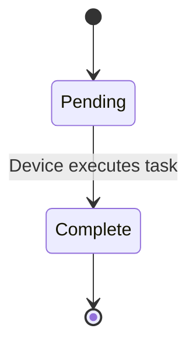
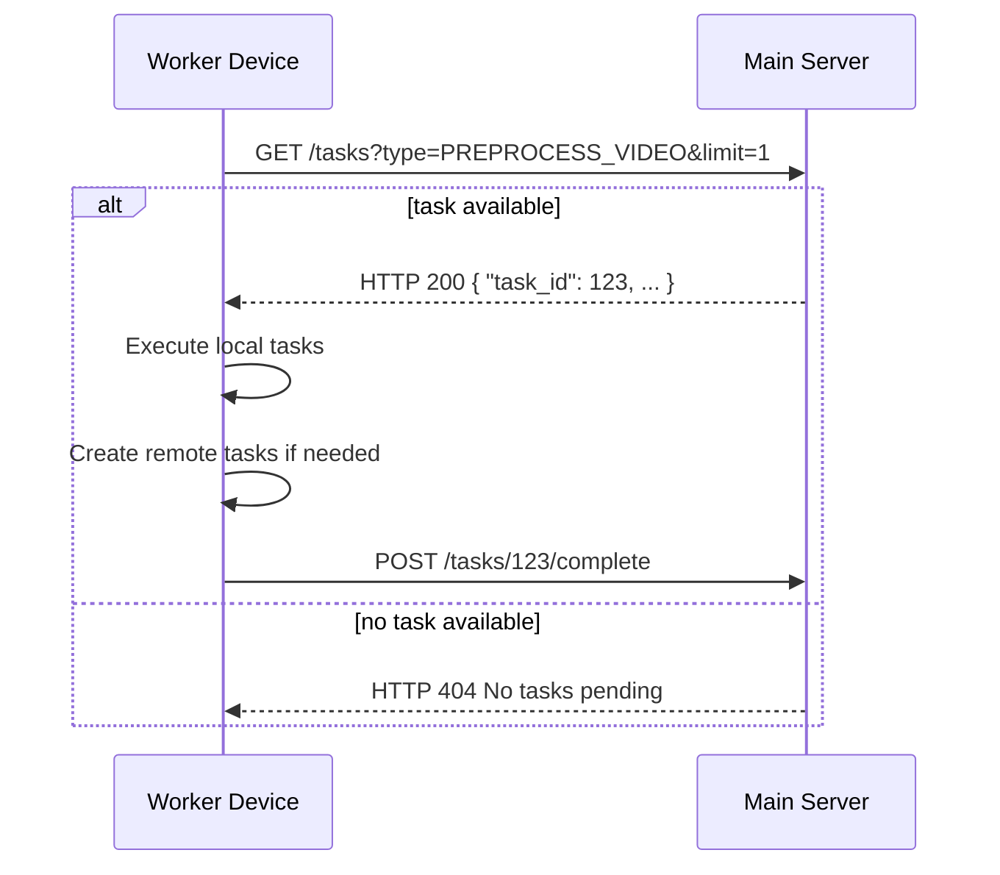
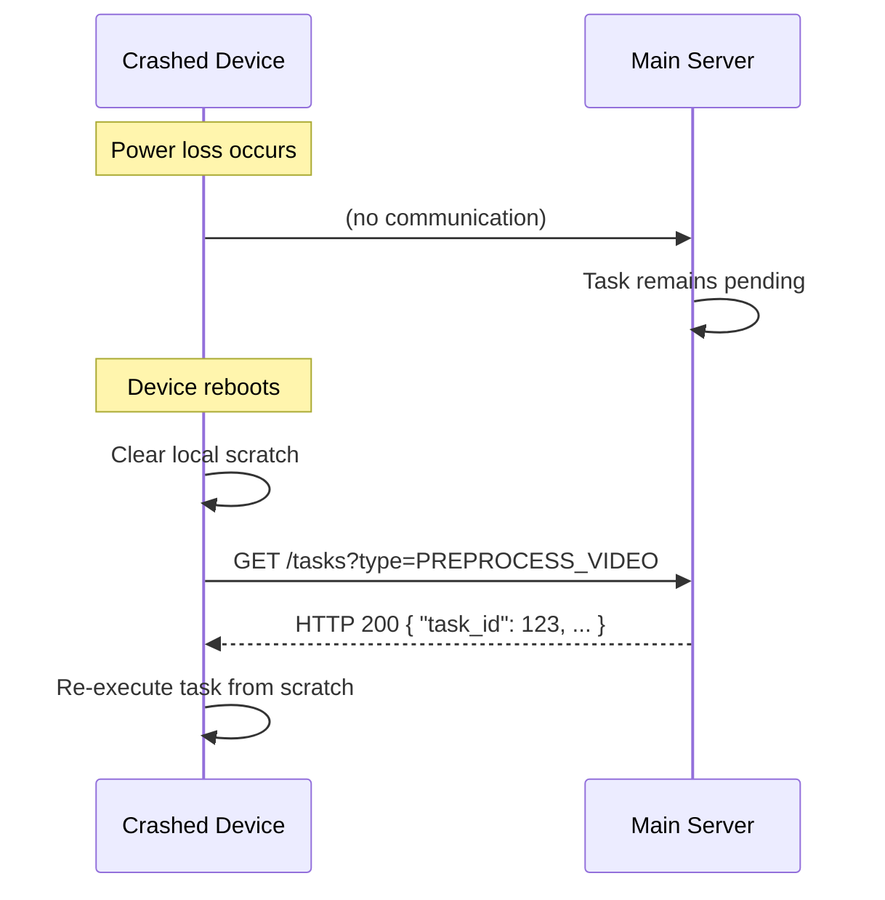
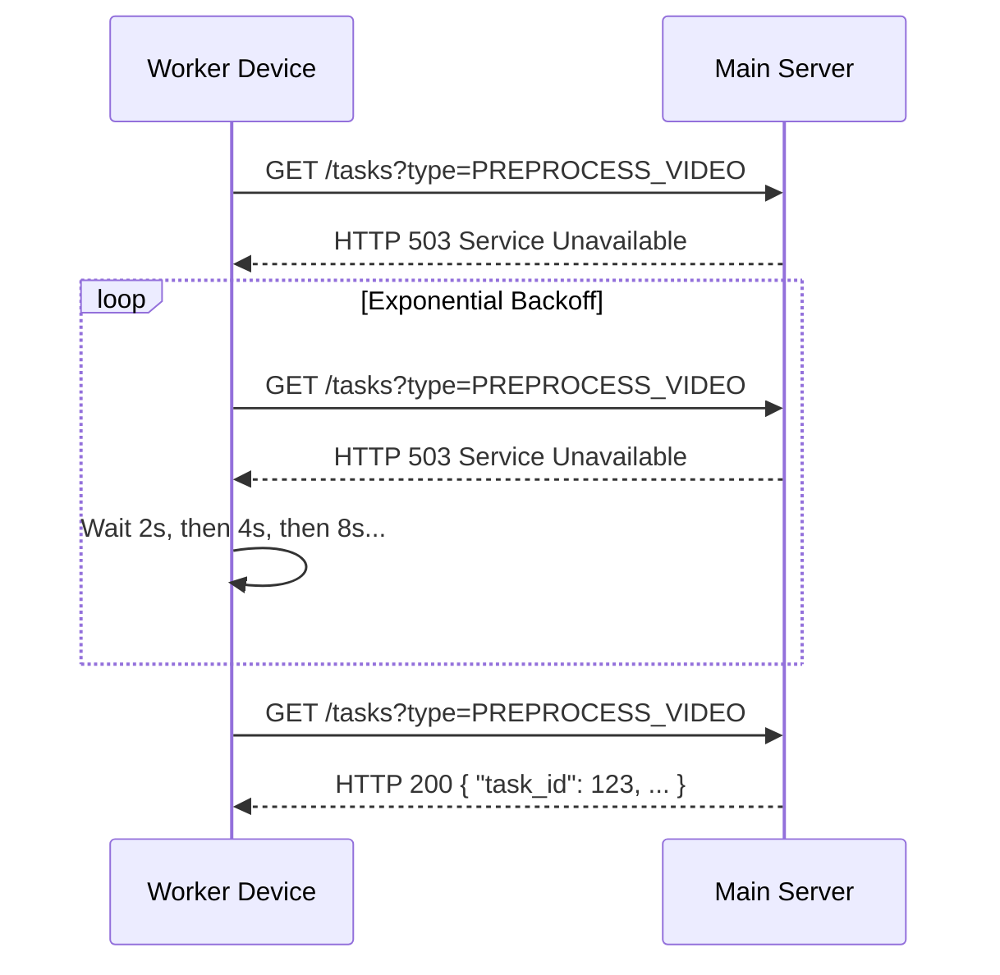
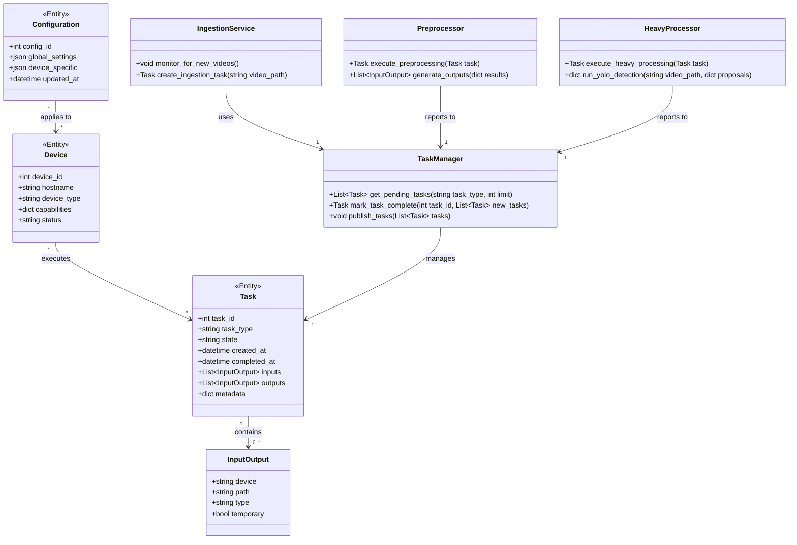
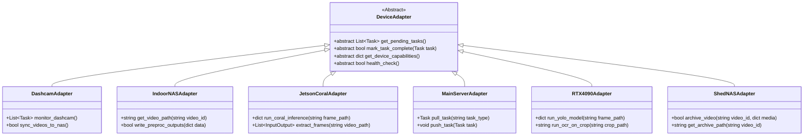
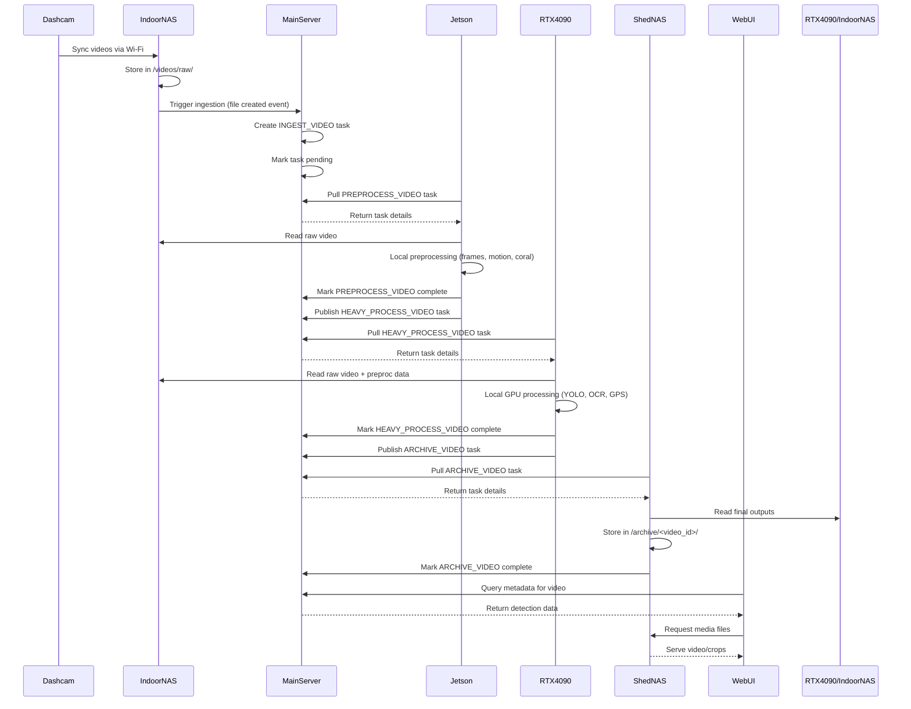
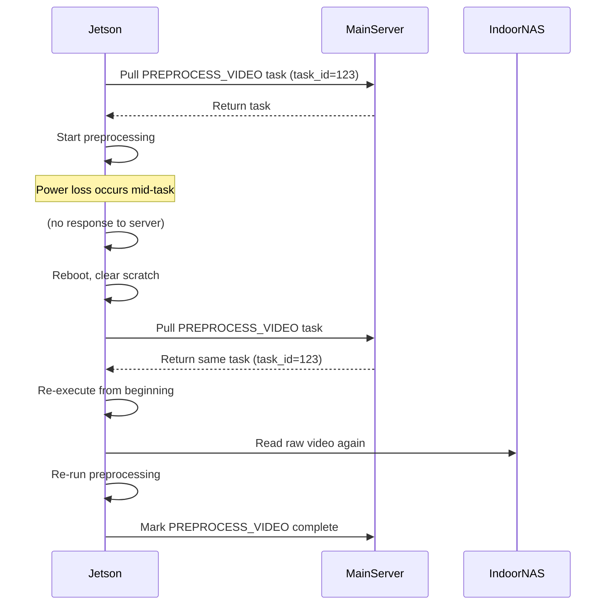

# Dashcam Processor System - Architectural Blueprint

## Table of Contents
1. [System Overview](#system-overview)
2. [Module Structure](#module-structure)
3. [Data Flow Architecture](#data-flow-architecture)
4. [Task System Design](#task-system-design)
5. [Device Adapters](#device-adapters)
6. [Configuration Management](#configuration-management)
7. [Error Handling & Recovery](#error-handling--recovery)
8. [API/Specification Documents](#apispecification-documents)
9. [Class Diagrams](#class-diagrams)
10. [Sequence Diagrams](#sequence-diagrams)

---

## 1. System Overview

The dashcam processor system is a distributed, fault-tolerant pipeline that processes raw dashcam footage through multiple stages of filtering, detection, and analysis to produce searchable, GPS-aligned plate detection data.

**Core Principles:**
- Pull-based task execution (no pushing)
- Two-state model: `pending` and `complete`
- Deterministic, restartable operations
- Clear separation of concerns by device capability
- Minimal central coordination overhead

---

## 2. Module Structure

### 2.1 Core Modules

| Module | Responsibility | Location |
|--------|---------------|----------|
| **Task Manager** | Central task database and coordination | Main Server |
| **Ingestion Service** | Dashcam video ingestion and initial task creation | Indoor NAS + Main Server |
| **Preprocessor** | Lightweight filtering and plate region proposal | Jetson + Coral |
| **Heavy Processor** | Full-resolution detection, OCR, GPS alignment | 4090 Machine |
| **Archival Service** | Long-term media storage | Shed NAS |
| **WebUI Service** | Presentation layer for processed data | Web Server |
| **Configuration Manager** | Device-specific settings and global configuration | Main Server |

### 2.2 Detailed Module Breakdown

#### Task Manager
- Maintains task database (SQLite or similar)
- Provides REST/gRPC API for:
  - Pulling pending tasks by device type
  - Marking tasks as complete
  - Publishing new remote tasks
- Implements atomic state transitions
- Tracks task creation/completion timestamps

#### Ingestion Service
- Monitors Indoor NAS for new video files
- Creates `INGEST_VIDEO` tasks upon detection
- Extracts basic metadata (filename, size, timestamp)
- Triggers preprocessing workflow via task creation

#### Preprocessor
- Pulls `PREPROCESS_VIDEO` tasks
- Performs:
  - Frame extraction at reduced resolution
  - Motion filtering (80-95% frame reduction)
  - Coral TPU-based plate region proposals
  - Basic quality metrics collection
- Outputs compact JSON metadata + thumbnails
- Publishes `HEAVY_PROCESS_VIDEO` tasks

#### Heavy Processor
- Pulls `HEAVY_PROCESS_VIDEO` tasks
- Performs:
  - Full-resolution YOLO detection (using Jetson proposals)
  - GPU-accelerated OCR with multi-frame aggregation
  - GPS timestamp alignment and coordinate mapping
  - Best crop/frame selection algorithms
- Outputs comprehensive detection metadata
- Publishes `ARCHIVE_VIDEO` tasks

#### Archival Service
- Pulls `ARCHIVE_VIDEO` tasks
- Stores finalized media:
  - De-resolved videos (720p/540p)
  - High-resolution plate crops
  - Best-frame thumbnails
- Provides static file serving for WebUI
- Implements retention policies

#### WebUI Service
- Reads metadata from Main Server API
- Reads media from Shed NAS filesystem
- Provides interactive browsing interface
- Supports search, filtering, and visualization

#### Configuration Manager
- Stores global and device-specific settings
- Manages:
  - Processing thresholds (motion, quality)
  - Retention policies
  - Device capabilities and limits
  - Task priorities
- Supports runtime configuration updates

---

## 3. Data Flow Architecture

### 3.1 Overall Pipeline

```
Dashcam → Indoor NAS → Jetson+Coral → Main Server → 4090 Machine → Shed NAS → WebUI
```

### 3.2 Data Flow Details

#### Ingestion Phase
```
Dashcam (MP4 files)
    ↓
Indoor NAS (/videos/raw/<trip>/)
    ↓
Main Server (INGEST_VIDEO task created)
    ↓
Main Server DB (task: pending)
```

#### Preprocessing Phase
```
Jetson (pulls PREPROCESS_VIDEO task)
    ↓
Indoor NAS (reads raw video)
    ↓
Jetson (local processing)
    ↓
Jetson outputs:
  - preproc.json (compact metadata)
  - thumbs/ (small thumbnails)
    ↓
Indoor NAS (/videos/preproc/<video_id>/) [optional]
    ↓
Main Server (HEAVY_PROCESS_VIDEO task published)
```

#### Heavy Processing Phase
```
4090 Machine (pulls HEAVY_PROCESS_VIDEO task)
    ↓
Indoor NAS (reads raw video + preproc data)
    ↓
4090 Machine (local GPU processing)
    ↓
4090 outputs:
  - detections.json (full metadata)
  - plate_crops/ (high-res crops)
    ↓
Main Server (ARCHIVE_VIDEO task published)
```

#### Archival Phase
```
Shed NAS (pulls ARCHIVE_VIDEO task)
    ↓
Shed NAS (/archive/<video_id>/)
  - video_lowres.mp4
  - plates/<plate_id>_best_crop.jpg
    ↓
WebUI (serves finalized data)
```

### 3.3 Data Storage Locations

| Stage | Artifact | Location | Lifecycle |
|-------|----------|----------|-----------|
| Raw | MP4 video files | Indoor NAS | Until processing complete |
| Preproc | JSON metadata + thumbnails | Indoor NAS (or Jetson local) | Until heavy processing |
| Heavy | Detection metadata + crops | 4090 Machine (local) | Until archival |
| Final | De-res video + plate crops | Shed NAS | Long-term |
| Metadata | All structured data | Main Server DB | Permanent |

---

## 4. Task System Design

### 4.1 Task Types and Flow

```
INGEST_VIDEO
    ↓ (Main Server creates)
PREPROCESS_VIDEO
    ↓ (Jetson publishes after completion)
HEAVY_PROCESS_VIDEO
    ↓ (4090 publishes after completion)
ARCHIVE_VIDEO
    ↓ (Shed NAS marks complete)
FINALIZE_VIDEO [optional]
```

### 4.2 Task State Machine



### 4.3 Task Creation Rules

1. **Ingestion Task Creation**
   - Triggered by: New file in `/videos/raw/`
   - Created by: Main Server ingestion daemon
   - Publishes: `PREPROCESS_VIDEO` task after completion

2. **Preprocessing Task Creation**
   - Triggered by: Manual or automated workflow start
   - Created by: System administrator or scheduled job
   - Publishes: `HEAVY_PROCESS_VIDEO` task after completion

3. **Heavy Processing Task Creation**
   - Triggered by: `PREPROCESS_VIDEO` completion
   - Created by: Jetson device
   - Publishes: `ARCHIVE_VIDEO` task after completion

4. **Archival Task Creation**
   - Triggered by: `HEAVY_PROCESS_VIDEO` completion
   - Created by: 4090 machine
   - Publishes: None (final stage)

### 4.4 Device Eligibility Matrix

| Task Type | Dashcam | Indoor NAS | Jetson+Coral | Main Server | 4090 Machine | Shed NAS |
|-----------|---------|------------|--------------|-------------|--------------|----------|
| INGEST_VIDEO | ❌ | ✅ | ❌ | ✅ | ❌ | ❌ |
| PREPROCESS_VIDEO | ❌ | ❌ | ✅ | ❌ | ❌ | ❌ |
| HEAVY_PROCESS_VIDEO | ❌ | ❌ | ❌ | ❌ | ✅ | ❌ |
| ARCHIVE_VIDEO | ❌ | ❌ | ❌ | ✅ | ❌ | ✅ |

### 4.5 Task Execution Protocol



---

## 5. Device Adapters

### 5.1 Adapter Interface Specification

```python
class DeviceAdapter(ABC):
    """Abstract base class for all device adapters"""

    @abstractmethod
    def get_pending_tasks(self, task_type: str, limit: int = 1) -> List[Task]:
        """Pull pending tasks of specified type"""
        pass

    @abstractmethod
    def mark_task_complete(self, task_id: int, new_tasks: List[Task] = None) -> bool:
        """Mark task as complete and optionally publish new tasks"""
        pass

    @abstractmethod
    def get_device_capabilities(self) -> DeviceCapabilities:
        """Return device hardware capabilities"""
        pass

    @abstractmethod
    def health_check(self) -> bool:
        """Verify device is operational"""
        pass
```

### 5.2 Concrete Adapters

#### DashcamAdapter
- **Purpose**: Monitor and ingest dashcam footage
- **Interfaces**:
  - Wi-Fi file transfer API
  - SD card mounting interface
- **Capabilities**:
  - Storage: SD card capacity monitoring
  - Connectivity: Wi-Fi signal strength
  - Battery level (if applicable)

#### IndoorNASAdapter
- **Purpose**: Central storage hub and ingestion gateway
- **Interfaces**:
  - SMB/NFS file sharing
  - `viofosync` integration
  - Storage capacity monitoring
- **Capabilities**:
  - Read throughput: 100+ MB/s
  - Write throughput: 50+ MB/s
  - Available space tracking

#### JetsonCoralAdapter
- **Purpose**: Lightweight preprocessing and filtering
- **Interfaces**:
  - Coral TPU inference API
  - OpenCV for frame processing
  - Task queue management
- **Capabilities**:
  - Coral TPU: 4 TOPS
  - CPU: Quad-core ARM
  - RAM: 4GB or less
  - Local storage: SSD/HDD for scratch

#### MainServerAdapter
- **Purpose**: Central task coordinator
- **Interfaces**:
  - REST/gRPC API for task management
  - SQLite database connection
  - Configuration service
- **Capabilities**:
  - Task queue depth monitoring
  - Database performance metrics
  - Configuration validation

#### RTX4090Adapter
- **Purpose**: Heavy GPU processing
- **Interfaces**:
  - CUDA/CuDNN for GPU acceleration
  - YOLO model inference API
  - OCR engine integration
- **Capabilities**:
  - GPU: 16384 CUDA cores, 24GB VRAM
  - CPU: Multi-core x86
  - NVMe SSD: Fast local scratch storage

#### ShedNASAdapter
- **Purpose**: Long-term archival storage
- **Interfaces**:
  - SMB/NFS for file serving
  - HTTP static file server
  - Retention policy engine
- **Capabilities**:
  - Storage: Multi-TB capacity
  - Read throughput: 100+ MB/s
  - Write throughput: 50+ MB/s

---

## 6. Configuration Management

### 6.1 Configuration Hierarchy

```
Global Config (Main Server)
├── Device-Specific Configs
│   ├── Jetson_1
│   ├── Jetson_2
│   ├── RTX4090_1
│   └── ...
└── Processing Profiles
    ├── Default
    ├── High-Quality
    └── Fast-Mode
```

### 6.2 Configuration Schema

```json
{
  "global": {
    "task_retry_delay_seconds": 300,
    "max_concurrent_tasks_per_device": 1,
    "storage_retention_days": {
      "raw_videos": 90,
      "preproc_data": 30,
      "heavy_output": 7
    }
  },
  "devices": {
    "jetson_coral_1": {
      "hostname": "jetson-1",
      "task_types": ["PREPROCESS_VIDEO"],
      "capabilities": {
        "coral_tpu_available": true,
        "max_memory_gb": 4,
        "scratch_space_gb": 32
      },
      "processing": {
        "frame_extraction_resolution": "640x480",
        "motion_threshold": 0.15,
        "min_plate_confidence": 0.6
      }
    },
    "rtx_4090_1": {
      "hostname": "gpu-worker-1",
      "task_types": ["HEAVY_PROCESS_VIDEO"],
      "capabilities": {
        "cuda_cores": 16384,
        "vram_gb": 24,
        "scratch_space_gb": 500
      },
      "processing": {
        "yolo_model_path": "/models/yolov8n.pt",
        "ocr_model_path": "/models/plate.pt",
        "max_frames_per_batch": 16,
        "gps_alignment_tolerance_ms": 200
      }
    }
  },
  "storage_paths": {
    "indoor_nas": {
      "base": "//nas-1/videos/",
      "raw": "raw/",
      "preproc": "preproc/",
      "heavy_output": "heavy_output/"
    },
    "shed_nas": {
      "archive_base": "//shed-nas/archive/"
    }
  }
}
```

### 6.3 Configuration Management API

```python
class ConfigManager:
    def get_global_config(self) -> dict:
        """Get complete global configuration"""
        pass

    def get_device_config(self, device_id: str) -> dict:
        """Get configuration for specific device"""
        pass

    def update_config(self, config_update: dict, device_id: str = None) -> bool:
        """Update configuration (with validation)"""
        pass

    def validate_config(self) -> List[str]:
        """Validate all configurations and return errors"""
        pass

    def watch_for_changes(self, callback: Callable) -> None:
        """Subscribe to configuration changes"""
        pass
```

---

## 7. Error Handling & Recovery

### 7.1 Fault Tolerance Strategies

| Failure Scenario | Detection Method | Recovery Strategy |
|------------------|------------------|-------------------|
| Device power loss | Task remains `pending` after timeout | Device reboots, pulls same task again |
| Network partition | Task pull/fetch fails | Exponential backoff retry |
| Storage full | Write operation fails | Publish cleanup task, wait for space |
| Processing error | Task marked complete with error flag | Human intervention or automatic retry |
| Corrupted video file | Validation failure during ingestion | Skip file, mark task as failed |
| GPU driver crash | Health check failure | Restart GPU processes |

### 7.2 Recovery Workflows

#### Device Crash Recovery


#### Network Failure Recovery


### 7.3 Error Classification

```python
class ProcessingError(Exception):
    """Base class for all processing errors"""
    pass

class IngestionError(ProcessingError):
    """Failed to ingest video file"""
    def __init__(self, filename: str, reason: str):
        self.filename = filename
        self.reason = reason

class PreprocessingError(ProcessingError):
    """Preprocessing failed"""
    def __init__(self, task_id: int, frame: int = None, reason: str = None):
        self.task_id = task_id
        self.frame = frame
        self.reason = reason

class HeavyProcessingError(ProcessingError):
    """Heavy processing failed"""
    pass

class ArchivalError(ProcessingError):
    """Archival failed"""
    pass

class TaskSystemError(Exception):
    """Task system internal error"""
    pass
```

---

## 8. API/Specification Documents

### 8.1 REST API Specification

#### Base URL: `http://main-server:5000/api/v1`

| Endpoint | Method | Description | Request Body | Response |
|----------|--------|-------------|--------------|----------|
| `/tasks` | GET | List tasks (filtered by type/state) | `type`, `state`, `limit`, `offset` | Array of Task objects |
| `/tasks` | POST | Create new task | Task creation payload | Created Task object |
| `/tasks/{id}` | GET | Get specific task | | Task object |
| `/tasks/{id}` | PUT | Update task state | `{ "state": "complete" }` | Updated Task object |
| `/tasks/{id}/complete` | POST | Mark task complete | Optional: array of new tasks | Success message |
| `/devices` | GET | List registered devices | | Array of Device objects |
| `/devices/{id}` | GET | Get device details | | Device object |
| `/config` | GET | Get current configuration | | Configuration object |
| `/config` | PUT | Update configuration | Partial config update | Success message |
| `/health` | GET | System health check | | Health status |

### 8.2 Task Data Structure

```json
{
  "task_id": 123,
  "task_type": "PREPROCESS_VIDEO",
  "video_id": "trip_20240115_1423",
  "state": "pending",
  "created_at": "2024-01-15T14:25:00Z",
  "completed_at": null,
  "inputs": [
    {
      "device": "indoor_nas",
      "path": "//nas-1/videos/raw/trip_20240115_1423/front_001.mp4",
      "type": "video"
    }
  ],
  "outputs": [
    {
      "device": "indoor_nas",
      "path": "//nas-1/videos/preproc/trip_20240115_1423/candidates.json",
      "type": "metadata"
    },
    {
      "device": "jetson_local",
      "path": "/tmp/jetson/scratch/trip_20240115_1423/thumbs/",
      "type": "thumbnails",
      "temporary": true
    }
  ],
  "metadata": {
    "video_duration_seconds": 600,
    "estimated_frames": 18000,
    "gps_available": true
  },
  "device_capabilities_required": {
    "coral_tpu": true,
    "min_memory_gb": 2
  }
}
```

### 8.3 Device Capabilities Structure

```json
{
  "device_id": "jetson_coral_1",
  "hostname": "jetson-1.local",
  "task_types_supported": ["PREPROCESS_VIDEO"],
  "capabilities": {
    "cpu_cores": 4,
    "cpu_arch": "arm64",
    "memory_gb": 4,
    "storage_gb": {
      "total": 32,
      "available": 12
    },
    "gpu": {
      "vendor": "nvidia",
      "model": "jetson_nano",
      "cuda_cores": 128
    },
    "accelerators": [
      {
        "type": "coral_tpu",
        "tops": 4,
        "connected": true
      }
    ],
    "network": {
      "interface": "eth0",
      "speed_mbps": 1000,
      "latency_ms": 2
    }
  },
  "status": {
    "online": true,
    "last_heartbeat": "2024-01-15T14:30:00Z",
    "tasks_running": 0,
    "tasks_pending_locally": 0
  }
}
```

---

## 9. Class Diagrams

### 9.1 Core System Classes



### 9.2 Device Adapter Hierarchy



---

## 10. Sequence Diagrams

### 10.1 End-to-End Video Processing Flow



### 10.2 Task Retry Scenario



---

## Implementation Notes

1. **Database Choice**: Use SQLite for the task database on the main server due to its simplicity, durability, and low overhead.

2. **Communication Protocol**: REST over HTTP/JSON is recommended for initial implementation; can be replaced with gRPC for higher performance if needed.

3. **Task Prioritization**: Implement FIFO ordering with optional priority flags for urgent tasks (e.g., recent videos).

4. **Monitoring**: Add health check endpoints and basic metrics collection to track system status.

5. **Testing Strategy**:
   - Unit tests for individual components
   - Integration tests for task flow between devices
   - Failure scenario testing (power loss, network outages)
   - Performance benchmarking for bottleneck identification

This architectural blueprint provides a complete specification for implementing the dashcam processor system with all the requirements from the analysis report.