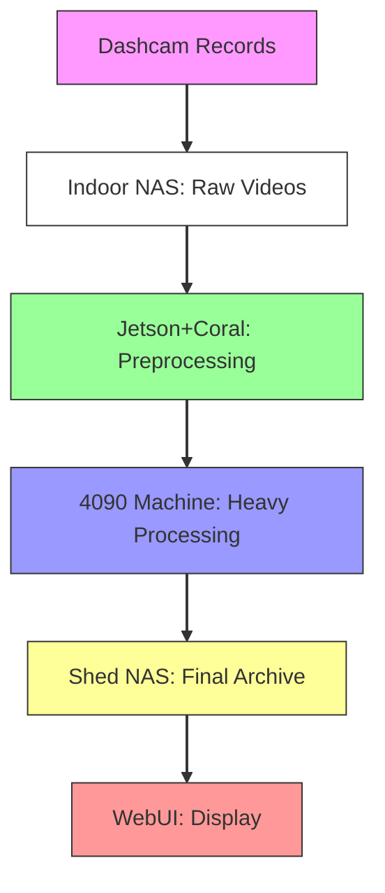
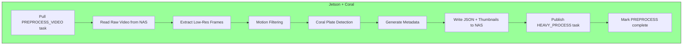
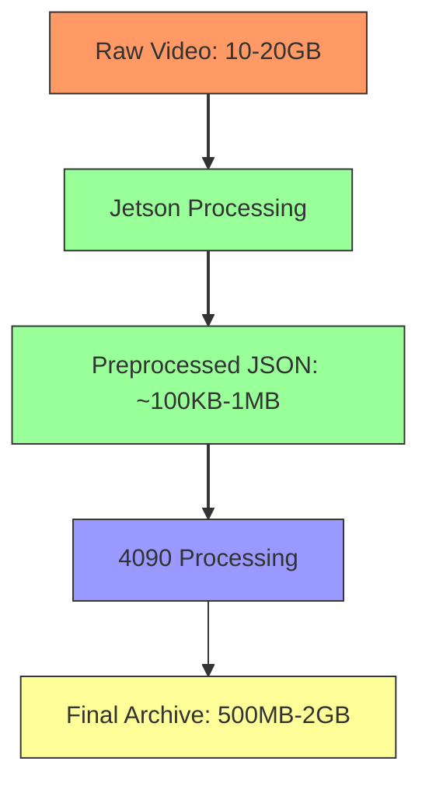
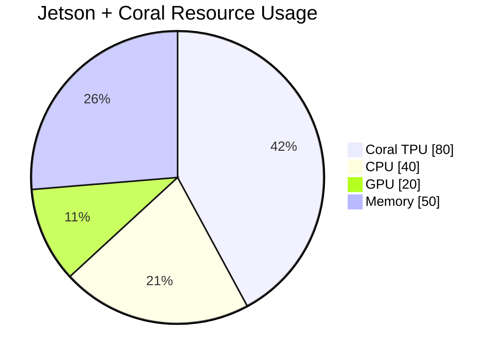
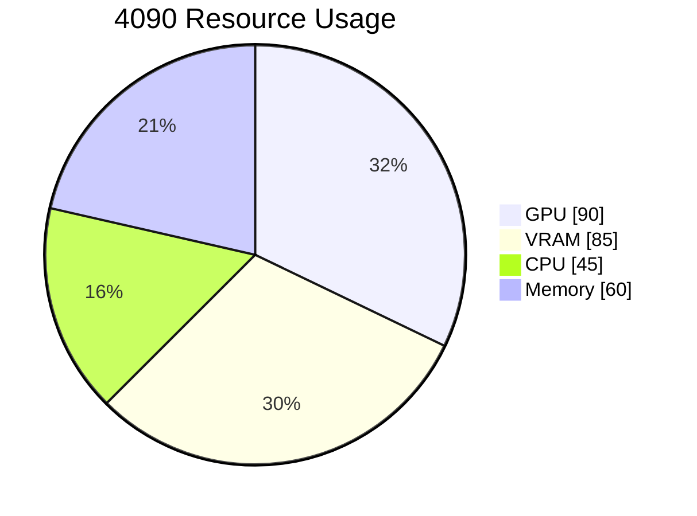
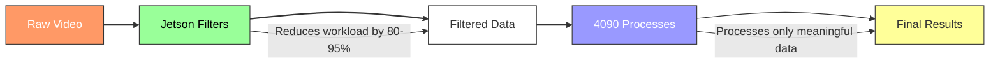

# Workload Separation Visual Diagram

## Pipeline Architecture Overview



## Detailed Workload Breakdown

### Jetson + Coral Preprocessing Stage



**Jetson Workload Details:**
- ✅ Frame extraction at reduced resolution (fast, efficient)
- ✅ Motion filtering (discards 80-95% of frames)
- ✅ Coral TPU plate region proposal (very efficient)
- ✅ Basic quality metrics (lighting, blur, confidence)
- ❌ NO full-resolution processing
- ❌ NO complex OCR or GPS alignment

### 4090 Machine Heavy Processing Stage


**4090 Workload Details:**
- ✅ Full-resolution YOLO detection (needs GPU power)
- ✅ High-quality plate crop extraction
- ✅ Complex OCR with multi-frame aggregation
- ✅ GPS timestamp alignment and mapping
- ✅ Final quality assurance and selection
- ❌ NO motion filtering or simple operations

---

## Workload Comparison Table

| Task | Jetson+Coral | 4090 Machine | Reason |
|------|--------------|--------------|--------|
| **Frame Extraction** | ✅ Low-res only | ❌ Not needed | Jetson can handle reduced res efficiently |
| **Motion Filtering** | ✅ Yes | ❌ No | Simple ops, huge workload reduction |
| **Plate Detection** | ✅ Coral TPU (coarse) | ❌ No | TPU optimized for this specific task |
| **Full YOLO Detection** | ❌ No | ✅ Yes | Needs 4090's GPU power and VRAM |
| **Plate Crop Extraction** | ❌ No | ✅ Yes | High-res crops need 4090 capabilities |
| **OCR Processing** | ❌ No | ✅ Yes | Complex aggregation needs compute power |
| **GPS Alignment** | ⚠️ Possible but not ideal | ✅ Yes | Better on x86 CPU with more resources |
| **Metadata Consolidation** | ❌ No | ✅ Yes | Complex structuring and QA |

---

## Data Volume Analysis



**Key Data Flow Points:**
- Raw video: 10-20GB per recording (stored on Indoor NAS)
- Jetson output: ~100KB-1MB of JSON + optional thumbnails
- **Data reduction: >99% through filtering!**
- Final archive: De-resolved video + high-res plate crops

---

## Resource Utilization Heatmap

### Jetson + Coral



### 4090 Machine



---

## Processing Time Breakdown

### Without Jetson Filtering (Hypothetical)
```
Full Video Processing:
- Load & decode: 10 minutes
- Full-res YOLO: 30 minutes
- OCR processing: 20 minutes
- GPS alignment: 5 minutes
- Metadata: 5 minutes
TOTAL: ~70 minutes per video
```

### With Jetson Filtering (Current Architecture)
```
Jetson Preprocessing:
- Frame extraction: 2 minutes
- Motion filtering: 3 minutes
- Plate detection: 1 minute
- Metadata: 1 minute
TOTAL: ~7 minutes

4090 Heavy Processing:
- Load filtered data: 1 minute
- Full-res YOLO on selected frames: 5 minutes
- OCR processing: 3 minutes
- GPS alignment: 2 minutes
- Metadata: 2 minutes
TOTAL: ~13 minutes

OVERALL: ~20 minutes (70% time reduction!)
```

---

## Conclusion Diagram



**The Key Insight:**
Jetson's role is to **filter aggressively**, removing 80-95% of unimportant frames.
4090's role is to **process accurately**, doing high-quality work on the remaining data.

This two-stage approach ensures optimal use of both devices' capabilities while maintaining reliability through the task system.
